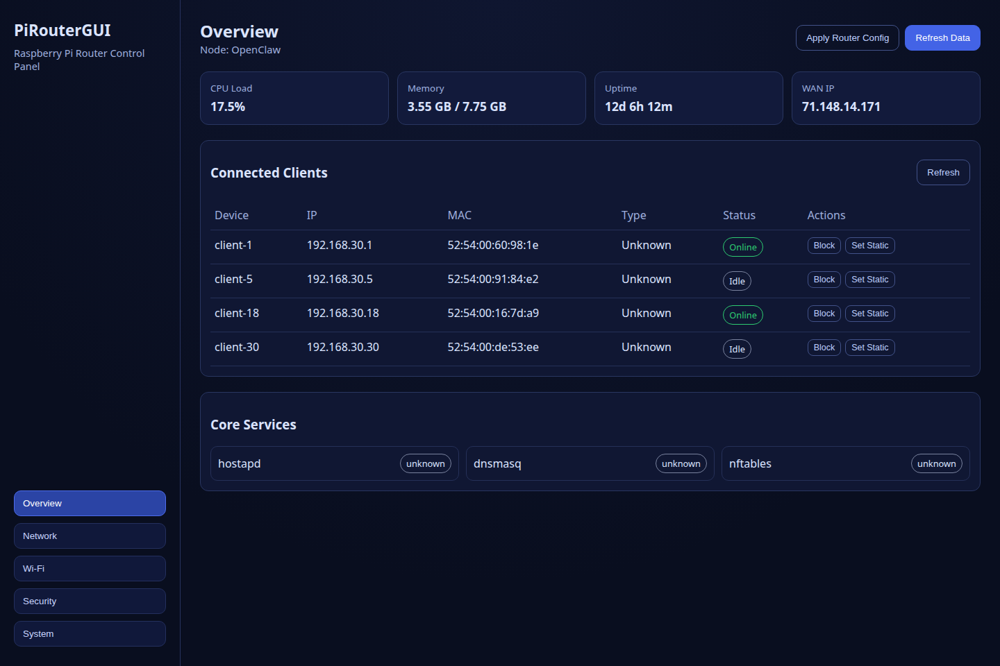
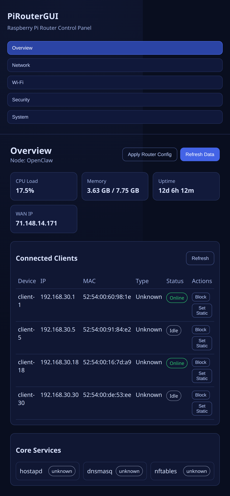

# PiRouterGUI

Pi-first router admin UI using **Python + FastAPI + HTMX** (no npm needed on Pi runtime).

## What it does

- Live overview (CPU, memory, uptime, WAN IP)
- Core service status (`hostapd`, `dnsmasq`, `nftables`)
- Client discovery (`ip neigh` + `dnsmasq.leases`)
- Client actions:
  - Block / Unblock (managed nftables file)
  - Set / Clear static lease (managed dnsmasq include)
- Auto-backup before every state/config write

## Screenshots





## Run (Python)

```bash
python3 -m venv .venv
source .venv/bin/activate
pip install -r requirements.txt
uvicorn app:app --host 0.0.0.0 --port 8080
```

Open: `http://<pi-ip>:8080`

## Safety model

- Runtime state file:
  - `state/client-actions.json`
- Backups:
  - `state/backups/*.bak`
- Managed config targets (separate files; no primary config overwrite):
  - `PRG_DNSMASQ_MANAGED_PATH` (default `/etc/dnsmasq.d/piroutergui-static.conf`)
  - `PRG_NFT_MANAGED_PATH` (default `/etc/nftables.d/piroutergui-blocklist.nft`)
- Validation before apply:
  - `dnsmasq --test`
  - `nft -c -f <managed file>`

## Legacy frontend/backend

The old React/Node prototype is still in the repo for reference (`src/`, `server/`, Vite files), but the recommended path for Pi deployment is the Python app.
