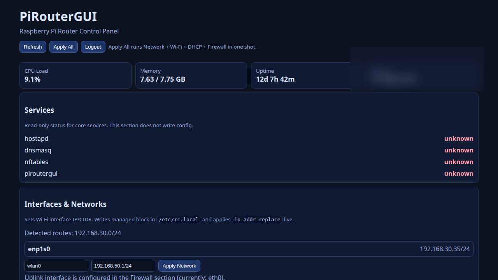
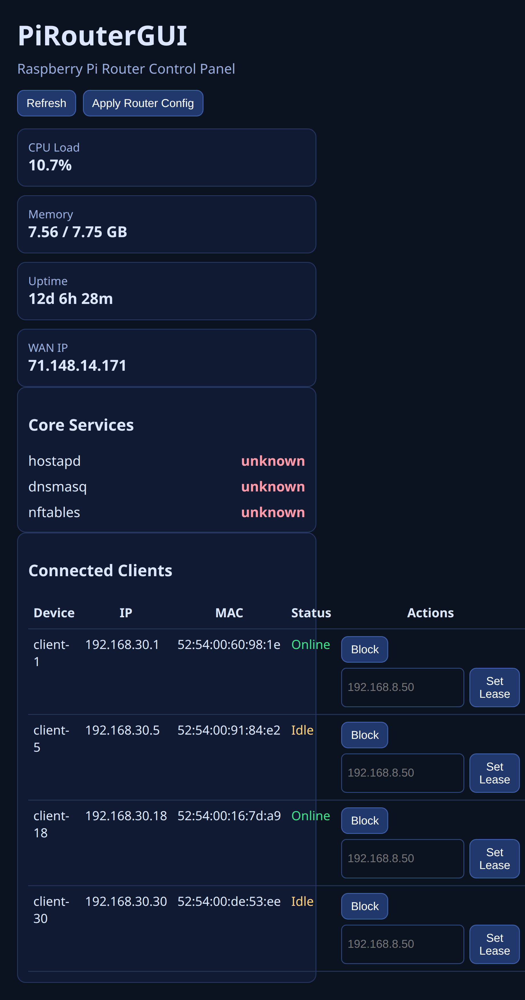

# PiRouterGUI

Pi-first router admin UI using **Python + FastAPI + HTMX**.

## What it does

- Live overview (CPU, memory, uptime, WAN IP)
- Core service status (`hostapd`, `dnsmasq`, `nftables`)
- Client discovery (`ip neigh` + `dnsmasq.leases`)
- Client actions:
  - Block / Unblock (managed nftables file)
  - Set / Clear static lease (managed dnsmasq include)
- Auto-backup before every state/config write

## Screenshots (current HTMX UI)





## Run locally (Python)

```bash
python3 -m venv .venv
source .venv/bin/activate
pip install -r requirements.txt
uvicorn app:app --host 0.0.0.0 --port 8080
```

Open: `http://<pi-ip>:8080`

---

## Docker deployment (FULL MODE)

⚠️ Full mode grants container host-level networking control.
Use only on a trusted Pi you control.

### 1) Start

```bash
git pull
sudo docker compose -f docker-compose.full.yml up -d --build
```

### 2) Open UI

`http://<pi-ip>:8080`

### Full mode details

- `network_mode: host`
- `privileged: true`
- `cap_add: NET_ADMIN, NET_RAW`
- Mounts host config paths:
  - `/etc/dnsmasq.d`
  - `/etc/nftables.d`
- Mounts runtime state:
  - `./state:/app/state`

### Verify container

```bash
sudo docker compose -f docker-compose.full.yml ps
sudo docker compose -f docker-compose.full.yml logs -f
```

---

## Safety model

- Runtime state file:
  - `state/client-actions.json`
- Backups:
  - `state/backups/*.bak`
- Managed config targets (separate files; no primary config overwrite):
  - `PRG_DNSMASQ_MANAGED_PATH` (default `/etc/dnsmasq.d/piroutergui-static.conf`)
  - `PRG_NFT_MANAGED_PATH` (default `/etc/nftables.d/piroutergui-blocklist.nft`)
- Validation before apply:
  - `dnsmasq --test`
  - `nft -c -f <managed file>`

